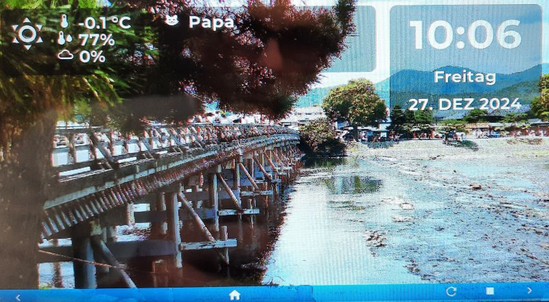
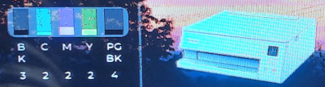
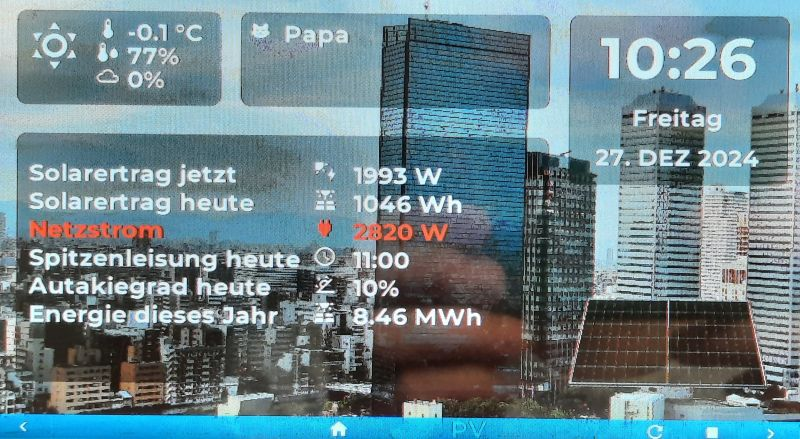
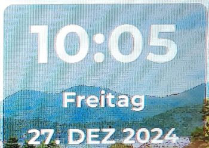
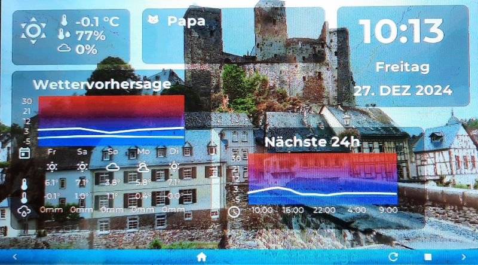

# My home automation display

## Introduction
This projects shows the status of my HomeAssistant system on a [Waveshare 7" LCD](https://www.waveshare.com/wiki/ESP32-S3-Touch-LCD-7) display.



## Set-Up
I found the basic set-up for my Waveshare 7" display in the [HA forum](https://community.home-assistant.io/t/esp32-s3-4-3inch-capacitive-touch-display-from-waveshare/658279/19) and adapted it a bit. See [lcd.yaml](lcd.yaml) for the main configuration.

## Pages
I decided to show the most basic information always, and add additional data as pages. Most basic are the time, the current weather condition, and a messages window (which currently only contains our "cat toiled cleaning duty" message). Switching through the pages is done automatically, or via the buttons in the footer bar at the bottom.

### Car
Since we have an electrical vehicle, it is interesting to have some information about the battery state. This page is using the [Kia Uvo / Hyundai Bluelink](https://github.com/Hyundai-Kia-Connect/hyundai_kia_connect_api) integration via [HACS](https://www.hacs.xyz/). Additionally, the current charging amount from our wallbox is shown using the [MyEnergy](https://github.com/cjne/ha-myenergi) integration and some data from the device internal wifi sensor.

### Debug

See page [debug](lcd/debug/README.md).

### Internet
The Internet page shows some information about uploads and downloads and the capacity of our DSL line. It uses the [Fritz!](https://www.home-assistant.io/integrations/fritz) integration.

### Messages
I plan to add some more messages here (eg. birthday reminder, weather warnings, etc.), but currently this area just shows our "cat-sensor" (indicating who has to clean the cat toilet today).

### NAS
Since we use a Synology NAS, the corresponding [integration](https://www.home-assistant.io/integrations/synology_dsm) is used to show some information about the used space and CPU load.

### Printer


See page [printer](lcd/printer/README.md)

### Solar


See page [solar](lcd/solar/README.md).

### Time


See page [time](./lcd/time/README.md).

### Weather


See page [weather](lcd/weather/README.md).

## Additional functions

### background image

The changing background image probably is one of the highlights of the display. The images to show in the background are hosted on the Home Assistant server and a new image gets downloaded every now and then. Unfortunately, the online_image component uses a lot of memory which is not always available - in that case, only a black background image will be visible.
I hope that the situation gets better with the latest changes to the online_image component and LVGL version 9.
```Yaml
api:
  on_client_connected:
    - logger.log: "connected WIFI"
    - delay: 15s
    - script.execute: update_bg_image
    
interval:
  - interval: 30min
    then:
      - script.execute: update_bg_image

script:
  - id: update_bg_image
    then:
      - online_image.set_url:
          id: bg_image
          url: !lambda |-
            std::string base = "http://homeassistant.local:8123/local/bg_images/"; 
            std::srand(std::time(0));
            auto filename = base + "bg_image_" + std::to_string(rand() % 87 + 1) + ".png";
            ESP_LOGD("main", filename.c_str());
            return filename;
```
The update_bg_image script gets called every 30 minutes and when the display connects to the Home Assistant server. It fetches a random image named bg_image_N.png where N is a number from 1 to currently 87. All the images are scaled to 800x480 and are put in the directory /www/bg_images on the Home Assistant server. No additional integration is reqired in HA (just a restart if the directory /www was newly created).
I'm using [ImageMagick](https://imagemagick.org/index.php) to convert my photographs to PNG images and resize and rename them accordingly:
```bash
#!/usr/bin/bash
rm -f png/*
for f in *.jpg *.JPG
do
  ((i++))
  magick.exe $f -adaptive-resize 800x480! -quality 95 PNG24:png/bg_image_$i.png
done
```

### motion sensor
Most of the GPIO pins of the ESP32 are already used for the display itself. The most natural choice for the available GPIO is to attach a motion sensor. I used a HC-SR501 sensor which just runs out of the box. The display is configured to turn black when no motion is detected and even go to deep-sleep mode, when there is no motion for a longer period of time. When a motion is detected, the display is turned on again and also the motion sensor can wake the display from deep-sleep.

```Yaml
binary_sensor:
  - platform: gpio
    pin: 
      number: GPIO06
      allow_other_uses: true
    id: bewegungssensor
    name: "Bewegungssensor"
    device_class: motion
    on_press:
      then:
        - logger.log: "motion detected"
        - switch.turn_on: display_backlight
        - lvgl.resume:
    on_release:
      then:
        - logger.log: "no motion"
        - switch.turn_off: display_backlight
        - lvgl.pause:


lvgl:
  on_idle:
    timeout: !lambda "return (id(display_timeout).state * 1000);"
    then:
      if:
        condition:
          binary_sensor.is_off: bewegungssensor
        then:
          - logger.log: "LVGL is idle"
          - switch.turn_off: display_backlight
          - lvgl.pause:
        else:
          - logger.log: "LVGL idle, but still motion detected"
```

### deep sleep
Deep sleep is easy to configure and since we have an ESP32-S3, any GPIO pin can be used to wake-up from deep sleep (ie. the motion sensor in this case). I'm using an additional switch on my Home Assistant server to prevent any ESPHome device to go to deep sleep. This sometimes comes in handy when you want to (re-)flash the devices.

```Yaml
esphome:
  on_boot:
    priority: -100.0
    then:
      - script.execute: update_footer
      - script.execute: consider_deep_sleep

deep_sleep:
  id: deep_sleep_control
  sleep_duration: 30min
#  touch_wakeup: true
  wakeup_pin: 
    number: GPIO06
    allow_other_uses: true
  wakeup_pin_mode: KEEP_AWAKE

script:
  - id: consider_deep_sleep
    mode: queued
    then:
      - delay: 5min
      - if:
          condition:
            binary_sensor.is_on: prevent_deep_sleep
          then:
            - logger.log: 
                format: 'Skipping sleep, prevent_deep_sleep=%d'
                args: [ 'id(prevent_deep_sleep).state' ]
          else:
              - deep_sleep.enter: deep_sleep_control
      - script.execute: consider_deep_sleep
```


### fonts

**common/const.yaml:** This file contains definitions for the characters onf the [Material Design Icons](https://pictogrammers.com/library/mdi/) font. With these definitions is is possible to write eg. $mdi_compass instead of \U000F018B.
It is using a copy of the materialdesignicons-webfont.ttf font downloaded from [GitHub](https://github.com/Templarian/MaterialDesign-Webfont/tree/master). The font is licensed under the [Apache 2.0 license](https://www.apache.org/licenses/LICENSE-2.0) and copyrighted by [Pictogrammers](https://pictogrammers.com/). Fot texts, the Google-Font Montserrat is used. It is licensed under [SIL Open Font License, Version 1.1](https://openfontlicense.org/open-font-license-official-text/) and copyrighted by the [Montserrat Git Project Authors](https://github.com/JulietaUla/Montserrat.git).

**lcd/fonts.yaml:** Here are the font definitions. The following fonts are used in this project:
* _font_time:_ A big font used to show the clock on the top-right of the screen. This font just consists of digits an a colon.
* _font_mid:_ The default font in this project. It is a 25 point font with the normal characters, German umlauts and many idons from the Material Design Icons font.
* _font_small:_ A small font to show short texts eg. for the weather forecast.
* _font_footer:_ 15pt font used in the footer only.