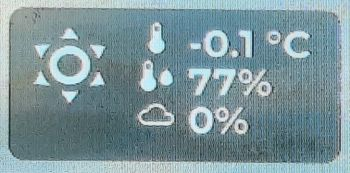
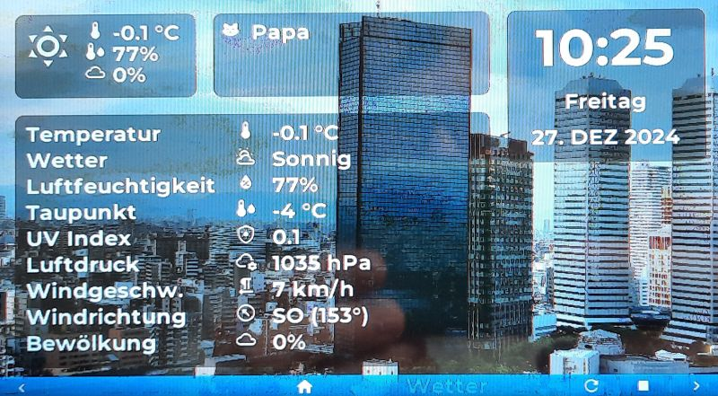

The Weather information is spread between three different areas: the top-left short information and two weather related pages.

#### Short info
The short weather information is shown on all pages and gives a quick weather overview. It contains of a weather icon in a bigger font (weather.forecast_home), the current temperature (weather.forecast_home.temperature), the humidity (weather.forecast_home.humidity), and the cloud coverage (weather.forecast_home.cloud_coverage).



#### Current weather


#### Weather forecast


This page uses the LVGL line widget to show the weather forecast. In addition, it uses two template sensors that I have defined in my Home-Assistent sever to query a weather forecast and send the corresponding data as text_sensor. Here is the template definition:
```Yaml
template:
  - trigger:
      - platform: time_pattern
        minutes: "/30"
    action:
      - service: weather.get_forecasts
        data:
          type: daily
        target:
          entity_id: weather.forecast_home
        response_variable: daily
      - variables:
          days: "{{ daily['weather.forecast_home'].forecast }}"
    sensor:
      - name: "Daily forecast"
        unique_id: daily_forecast
        state: >
          
          
            {{ as_timestamp(state.datetime)|timestamp_custom("%a") }};{{state.templow}};{{ state.temperature }};{{ state.precipitation }};{{ weather[state.condition] }}#
          
  - trigger:
      - platform: time_pattern
        minutes: "/10"
    action:
      - service: weather.get_forecasts
        data:
          type: hourly
        target:
          entity_id: weather.forecast_home
        response_variable: hourly
      - variables:
          hours: "{{ hourly['weather.forecast_home'].forecast }}"
    sensor:
      - name: "Hourly forecast"
        unique_id: hourly_forecast
        state: >
          
            {{ as_timestamp(state.datetime)|timestamp_custom("%H") }};{{ state.temperature }}#
          
```

Updating the line graphs is done in a complex !lambda expression that splits all the data from the text sensors and updated LVGL label texts and the line-data using a call to lv_line_set_points().